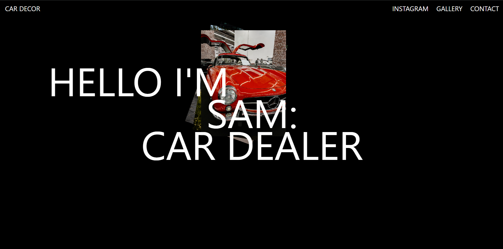

# GSAP Landing Page Practice

Welcome to the GSAP landing page practice project!It is my second GSAP landing page. This project is created purely for practice purposes to explore the capabilities of GSAP (GreenSock Animation Platform) library along with HTML and CSS.

## Overview

This landing page serves as a playground to experiment with GSAP animations and transitions. It showcases various animations applied to elements such as text, images, buttons, and backgrounds to create visually appealing effects and interactions.

## Features

- **Animation Effects**: Utilize GSAP to create captivating animations and transitions.
- **Interactive Elements**: Implement interactive elements with animated hover effects.
- **Responsive Design**: Ensure the landing page is responsive and accessible across different devices.

## Tech Stack

## Preview

## Live Website

Explore the live GSAP landing page practice project: [GSAP Landing Page]("")
